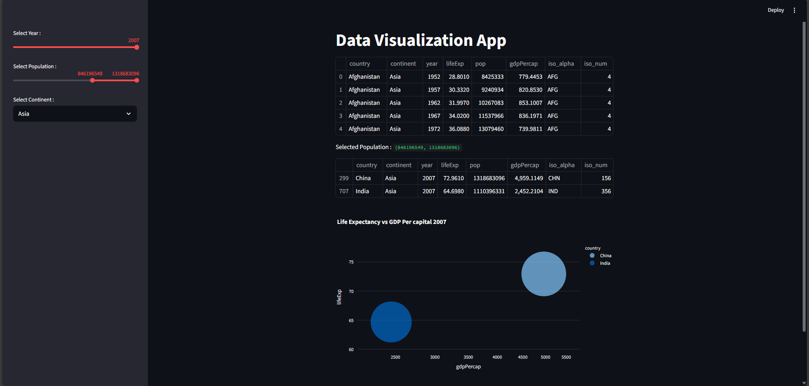

# 🌍 Data Visualization App (Streamlit + Plotly)

This project is an **interactive dashboard** built with [Streamlit](https://streamlit.io/) and [Plotly Express](https://plotly.com/python/plotly-express/) to explore the **Gapminder dataset**.  
It allows users to filter by year, continent, and population range to visualize how **GDP per capita** relates to **Life Expectancy** across different countries.

---

## 🚀 Features
- 📅 **Year Selection** → Choose a year between **1952 – 2007**.  
- 🌍 **Continent Filter** → Select a continent (Asia, Europe, Africa, Americas, Oceania).  
- 👥 **Population Range** → Adjust the slider to focus on countries within a specific population range.  
- 📊 **Interactive Scatter Plot** →  
  - X-axis: **GDP per Capita** (log scale)  
  - Y-axis: **Life Expectancy**  
  - Bubble Size: **Population**  
  - Bubble Color: **Country**  

---

## 🛠️ Tech Stack
- **Python**
- **Streamlit** → for interactive UI  
- **Plotly Express** → for data visualization  
- **Gapminder Dataset** (built-in from Plotly)

---

## 📂 Project Structure
```
📦 01_Dashboard-app
 ┣ 📜 01data.py      # Main Streamlit app
 ┣ 📜 requirements.txt    # Dependencies
 ┣ 📜 .gitignore          # Ignore virtual env, cache, etc.
 ┗ 📜 README.md           # Project documentation
```

---

## ⚙️ Installation & Setup

### 1. Clone this repo
```bash
git clone https://github.com/banerjee-aot/01_Dashboard-app.git
cd 01_Dashboard-app
```

### 2. Create virtual environment
```bash
python -m venv myenv
myenv\Scripts\activate   # Windows
source myenv/bin/activate  # Mac/Linux
```

### 3. Install dependencies
```bash
pip install -r requirements.txt
```

### 4. Run the app
```bash
streamlit run 01data.py
```

---

## 📷 Demo Screenshot

Here’s how the app looks:




---

## 🎯 Example Visualization
- Shows **Life Expectancy vs GDP per Capita** across countries.
- Bubble size represents **Population**.
- Users can interactively filter data.

---

## 📌 Requirements
- Python 3.8+
- Streamlit
- Plotly
---

## 🙌 Contributing
Pull requests are welcome!  
For major changes, please open an issue first to discuss what you’d like to change.

---

## 📜 License
[MIT License](LICENSE)
